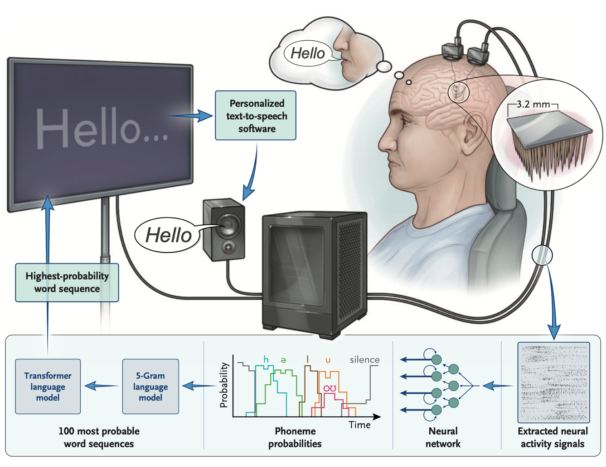

# An Accurate and Rapidly Calibrating Speech Neuroprosthesis
*The New England Journal of Medicine* (2024)

Nicholas S. Card, Maitreyee Wairagkar, Carrina Iacobacci,
Xianda Hou, Tyler Singer-Clark, Francis R. Willett,
Erin M. Kunz, Chaofei Fan, Maryam Vahdati Nia,
Darrel R. Deo, Aparna Srinivasan, Eun Young Choi,
Matthew F. Glasser, Leigh R. Hochberg,
Jaimie M. Henderson, Kiarash Shahlaie,
Sergey D. Stavisky*, and David M. Brandman*.

<span style="font-size:0.8em;">\* denotes co-senior authors</span>



<p style="text-align: center;">
<span style="font-size:2.5em;">
🚧🚧🚧 Additional data will be added over the next couple months to generate additional supplemental figures. Simulated data will also be added to demonstrate the decoder training and finetuning pipeline. Real neural data will be added in 2025. 🚧🚧🚧
</span>
</p>

## Overview
This repository contains the code and data necessary to reproduce the results of the paper "*An Accurate and Rapidly Calibrating Speech Neuroprosthesis*" by Card et al. (2024), *N Eng J Med*.

The code is written in Python, and the data can be downloaded from Dryad, [here](https://datadryad.org/stash/dataset/doi:10.5061/dryad.dncjsxm85). Please download this data and place it in the `data` directory before running the code.

Data is currently limited to what is necessary to reproduce the results in the paper, plus some additional simulated neural data that can be used to demonstrate the model training pipeline. A few language models of varying size and computational resource requirements are also included. We intend to share real neural data in the coming months.

The code is organized into four main directories: `utils`, `analyses`, `data`, and `model_training`:
- The `utils` directory contains utility functions used throughout the code.
- The `analyses` directory contains the code necessary to reproduce results shown in the main text and supplemental appendix.
- The `data` directory contains the data necessary to reproduce the results in the paper. Download it from Dryad using the link above and place it in this directory.
- The `model_training` directory contains the code necessary to train the brain-to-text model, including the offline model training and an offline simulation of the online finetuning pipeline, and also to run the language model. Note that the data used in the model training pipeline is simulated neural data, as the real neural data is not yet available.

## Python environment setup
The code is written in Python 3.9 and tested on Ubuntu 22.04. We recommend using a conda environment to manage the dependencies.

To install miniconda, follow the instructions [here](https://docs.anaconda.com/miniconda/miniconda-install/).

To create a conda environment with the necessary dependencies, run the following command from the root directory of this repository:
```bash
./setup.sh
```
